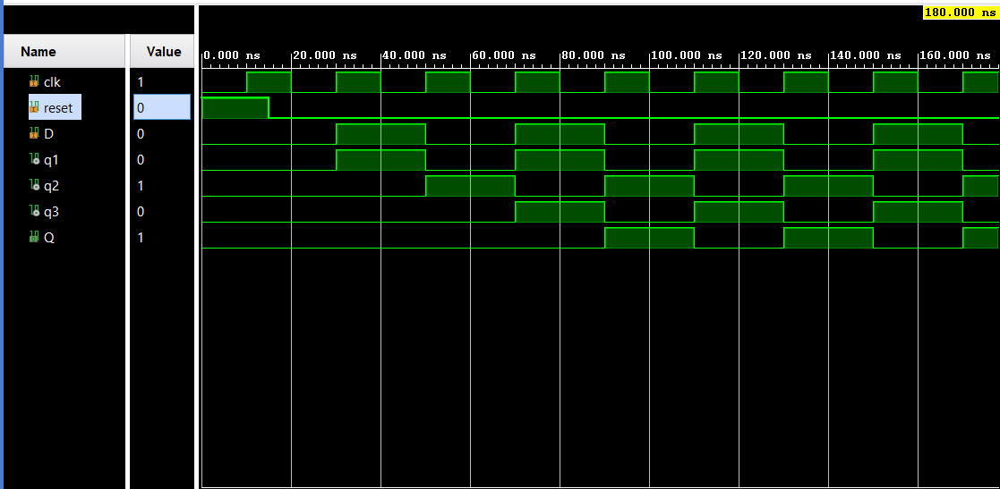
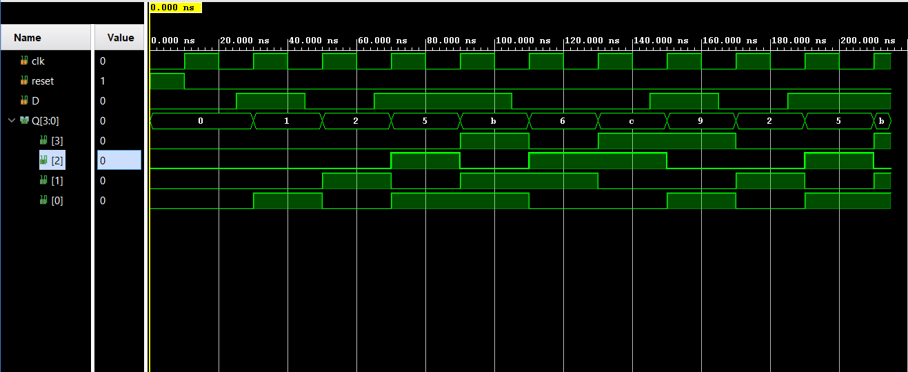
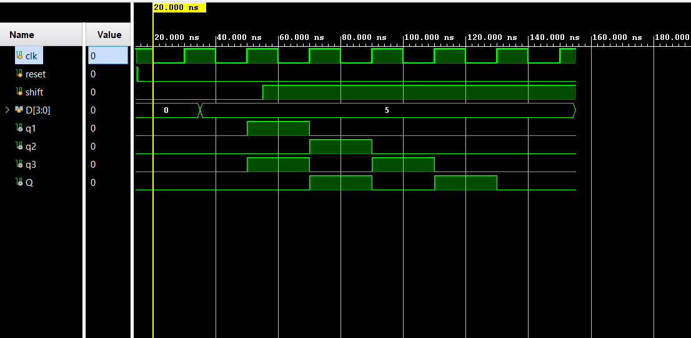
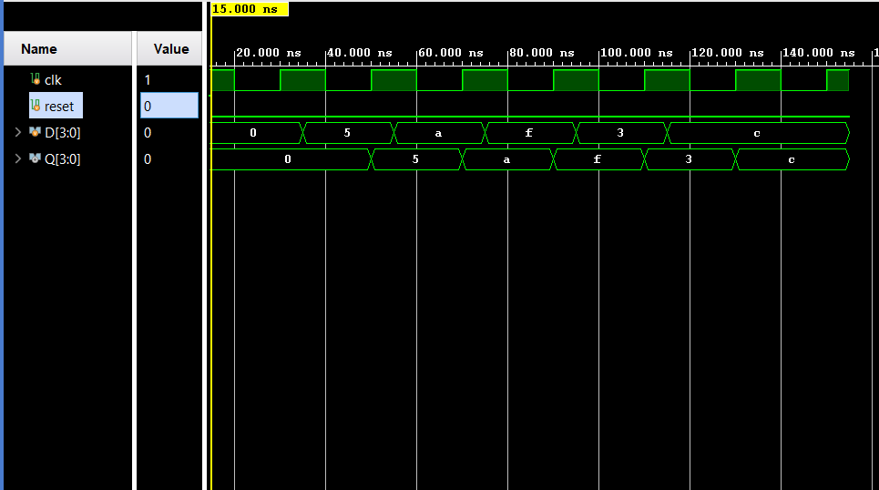

# Shift Registers in Verilog HDL

## Project Overview

This repository contains Verilog HDL implementations of fundamental shift register architectures along with their corresponding testbenches and simulation results. The designs were developed and verified using Xilinx Vivado.

## Implemented Designs

### 1. Serial-In Serial-Out (SISO)
- Accepts serial data input.
- Produces serial data output.
- Implemented using cascaded D Flip-Flops.

### 2. Serial-In Parallel-Out (SIPO)
- Accepts serial data input.
- Produces parallel data output.
- Used for serial-to-parallel data conversion.

### 3. Parallel-In Serial-Out (PISO)
- Loads data in parallel.
- Shifts data out serially.
- Used for parallel-to-serial data conversion.

### 4. Parallel-In Parallel-Out (PIPO)
- Loads data in parallel.
- Produces data in parallel.
- Functions as a basic register.

## Files Included

| File | Description |
|--------|------------|
| d_ff.v | D Flip-Flop with asynchronous reset |
| SISO.v | Serial-In Serial-Out Shift Register |
| SIPO.v | Serial-In Parallel-Out Shift Register |
| PISO.v | Parallel-In Serial-Out Shift Register |
| PIPO.v | Parallel-In Parallel-Out Shift Register |
| tb_SISO.v | Testbench for SISO |
| tb_SIPO.v | Testbench for SIPO |
| tb_PISO.v | Testbench for PISO |
| tb_PIPO.v | Testbench for PIPO |

## Simulation Results

Behavioral simulations were performed in Xilinx Vivado to verify the functionality of each shift register design. Waveform screenshots are included in the repository.

## Tools Used

- Verilog HDL
- Xilinx Vivado
- Behavioral Simulation

## Learning Outcomes

Through this project, the following concepts were explored:

- D Flip-Flop Design
- Sequential Logic Design
- Shift Register Architectures
- Parallel and Serial Data Transfer
- Testbench Development
- Functional Verification using Simulation

- ## Simulation Results

### SISO

### SIPO

### PISO

### PIPO

## Author
Madhu Visagan H T
